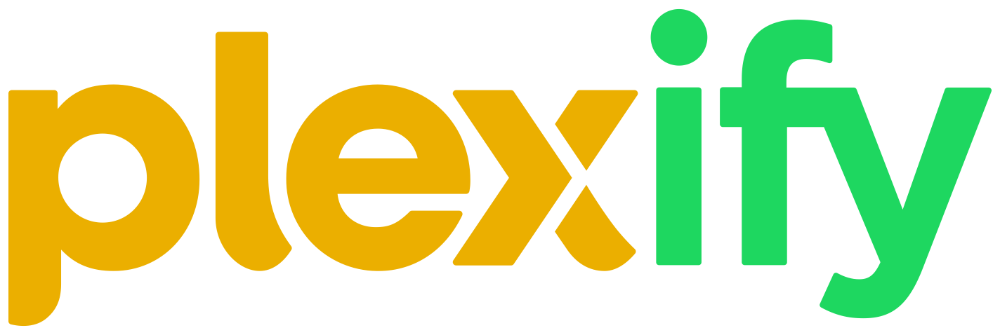
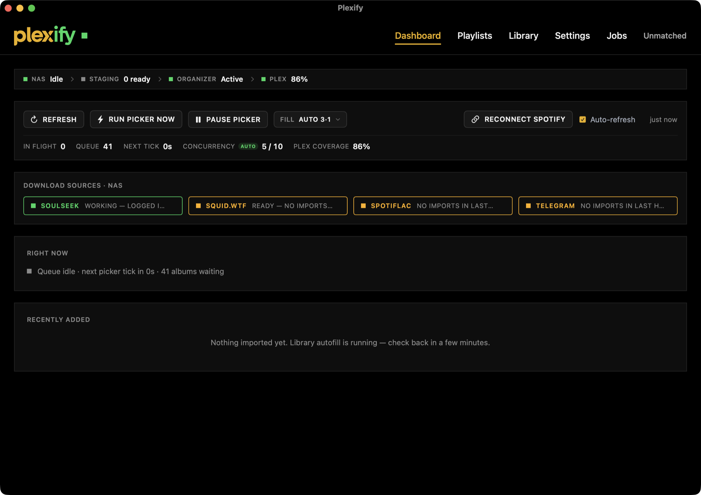
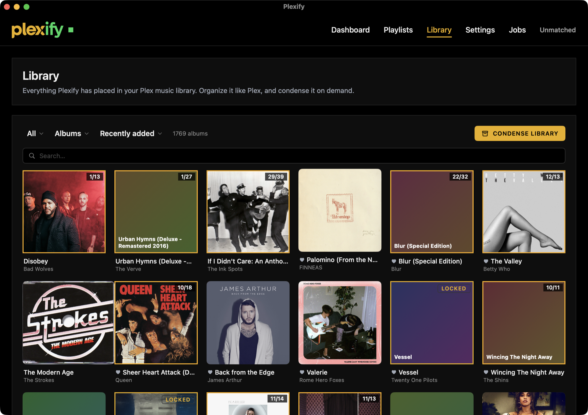
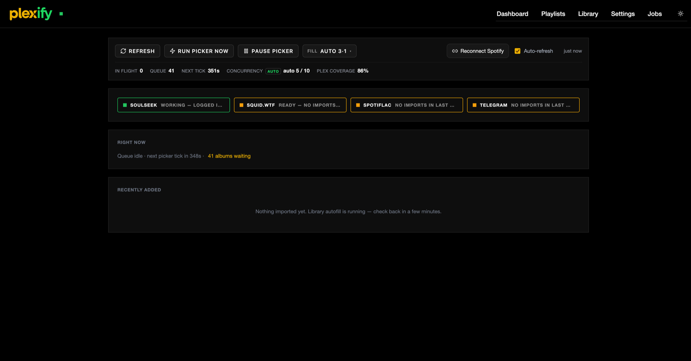
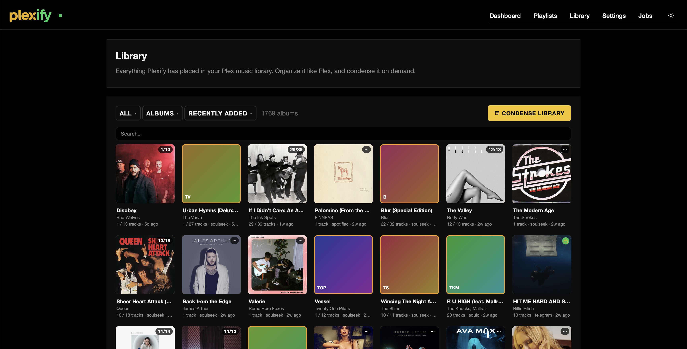

<div align="center">



**Keep your Plex music library in sync with Spotify — automatically, in lossless FLAC.**

_On the author's own server, Plexify has reached **86% coverage of 2,420 Liked Songs (~142 hours of music)** — filled in automatically as lossless FLAC._

</div>

Plexify mirrors your Spotify playlists and Liked Songs into Plex, then quietly fills the gaps: it finds the songs you've saved but don't own yet, acquires them as FLAC, tags and files them the way Plex expects, and keeps everything organized. It has a polished web UI (and an optional native macOS app), a first-run setup wizard, and a background engine that just keeps your library complete.

> [!IMPORTANT]
> **Read this first.** Plexify can acquire music from peer-to-peer and mirror sources. It is a **personal library tool** — you are responsible for how you use it, and you must have the legal right to any music you download. On first run you must accept an agreement to that effect before *any* downloading is enabled (enforced in the engine, not just the UI). Publishing or using this does not grant you any rights to copyrighted material. See [Legal](#legal).

---

## Screenshots

### Native macOS app

A fully native SwiftUI front-end (dark, OLED-black) — same engine, JSON API, and features as the web UI.

| Dashboard | Library |
|:---:|:---:|
| <a href="docs/screenshots/mac-dashboard.png"></a> | <a href="docs/screenshots/mac-library.png"></a> |

### Web UI

Served by the engine — everything the native app does, in the browser.

| Dashboard | Library |
|:---:|:---:|
| <a href="docs/screenshots/web-dashboard.png"></a> | <a href="docs/screenshots/web-library.png"></a> |

---

## Features

- **Spotify ⇄ Plex playlist sync** — two-way, snapshot-aware; your playlists live in both places and stay in order.
- **Liked-Songs library autofill** — the songs you've saved on Spotify but don't have in Plex get acquired in FLAC and filed automatically.
- **Multi-source acquisition** — Soulseek (P2P), squid.wtf (Qobuz hi-res), SpotiFLAC (Qobuz/Tidal/Deezer/Amazon mirrors), and Telegram — all optional, tried in your configured order, with per-source blacklisting on bad results.
- **Album completion & quality upgrades** — fills partial albums and re-acquires lossless tracks at hi-res when available.
- **Un-star to replace** — 5★ every placed track in Plex; un-star a wrong one and Plexify re-acquires the correct copy from a different source (opt-in).
- **Audiobooks** — the same drop folder takes books: folders of mp3s are merged into chapterized m4bs ([auto-m4b](https://github.com/seanap/auto-m4b)), matched against Audible with a confidence gate that never guesses, tagged via [Audnexus](https://audnex.us) (cover, narrator, summary — the *edition* is picked by matching runtime to your file, so narrators come out right), and filed into a separate Plex library. Low-confidence books wait in a review queue; the app has a cover-art shelf with sorting and soft-delete.
- **A real UI** — a fast web dashboard (library, playlists, jobs, live activity) plus an optional native macOS app.
- **Runs itself** — a scheduler handles syncing, acquisition, organization, Plex reconciliation, and hygiene in the background.

## How it works

Plexify is a Python (Flask + APScheduler) engine that talks to your Plex server and the Spotify Web API, backed by SQLite. The engine **decides what to acquire and organizes everything**; a small **downloader daemon** does the actual downloading near your storage. Both ship in one Docker image. The web UI is served by the engine; the native macOS app is an optional front-end that talks to the same JSON API.

```
Spotify ⇄ [ Plexify engine + web UI ] ⇄ Plex
                     │
                     ▼
          [ downloader daemon ] → Soulseek / squid.wtf / SpotiFLAC / Telegram
```

## Requirements

| Thing | Required? | Notes |
|---|---|---|
| **Plex Media Server** | Yes | You almost certainly already run one. Plexify reads + writes playlists and files FLACs into a library folder. |
| **Spotify Developer app** | Yes | Free, ~2 minutes — you use *your own* credentials. See [Connecting Spotify](#connecting-spotify). |
| **Docker + Docker Compose** | Recommended | The easiest way to run it. |
| **slskd (Soulseek)** | Optional | A Soulseek source. Without it you can still use the other sources. |
| **Lidarr** | Optional | Album organization / quality management. |
| **Telegram account** | Optional | Enables the Telegram source. |
| **auto-m4b + Audnexus agent** | Optional | Only for audiobooks — see [Adding audiobooks](#adding-audiobooks-optional). |

## Getting started

Setting Plexify up takes about **15 minutes**, and you only do it once. Here's the whole picture
before you start:

1. **Install it** with Docker (one command, below).
2. **Open the web page** it serves and let the **setup wizard** connect your Spotify and Plex.
3. **Turn on any download sources** you want (all optional).

You don't need to touch the code. The only file you edit is a short settings file called `.env`,
and the wizard handles the rest in your browser.

**Before you begin, have these ready:**

- **Docker Desktop** installed and running ([get it here](https://www.docker.com/products/docker-desktop/)) — this is what runs Plexify.
- Your **Plex server** already set up with a music library.
- A **Spotify account** (free is fine).

### Step 1 — Install Plexify

Open a terminal and run these three lines (this downloads Plexify and creates your settings file):

```bash
git clone https://github.com/<you>/plexify.git
cd plexify
cp .env.example .env
```

### Step 2 — Fill in your settings file

Open the new `.env` file in any text editor. You only need to set **three** things — the rest
have sensible defaults you can ignore for now:

| Setting | What to put | How to find it |
|---|---|---|
| `MUSIC_DIR` | The full path to the folder where Plex keeps your **music** | In Plex: **Settings → your Music library → Edit → Folders**. Copy that folder path. |
| `DOWNLOADS_DIR` | Any empty folder Plexify can use as a **workspace** for downloads-in-progress | Make a new folder anywhere with space, e.g. `/Users/you/plexify-downloads`, and paste its path. |
| `PUBLIC_BASE_URL` | The web address **you'll open Plexify at** | Leave it as `http://localhost:8787` if you'll use Plexify on this same computer. Only change it if you'll open it from another device (then use `http://<this-computer's-ip>:8787`). |

Example of a filled-in `.env` (just those three lines):

```bash
MUSIC_DIR=/Volumes/Media/Music
DOWNLOADS_DIR=/Volumes/Media/plexify-downloads
PUBLIC_BASE_URL=http://localhost:8787
```

> **Why `PUBLIC_BASE_URL` matters:** Spotify sends you back to this exact address after you log
> in, so it has to be the address you're actually using. `localhost` only works if you're setting
> up on the same computer that's running Plexify.

### Step 3 — Start it

Back in the terminal, run:

```bash
docker compose up -d --build
```

The first run takes a few minutes while it builds. When it finishes, open
**http://localhost:8787** (or whatever you set `PUBLIC_BASE_URL` to) in your browser.

You'll see a **setup wizard**. It walks you through connecting Spotify and Plex and accepting the
usage agreement — the next two sections explain each step. Once you finish it, Plexify starts
filling in your library on its own.

### Connecting Spotify

The wizard will ask for a Spotify **Client ID** and **Client Secret**. These are free and take
about two minutes to create — they let Plexify read *your* playlists and Liked Songs (you're
using your own credentials, nothing is shared).

1. Go to the [Spotify Developer Dashboard](https://developer.spotify.com/dashboard) and log in.
2. Click **Create app**. Give it any name and description (e.g. "Plexify").
3. In the **Redirect URI** box, paste your Plexify address followed by `/auth/spotify/callback`.
   If you kept the default, that's exactly:
   ```
   http://localhost:8787/auth/spotify/callback
   ```
   (If you changed `PUBLIC_BASE_URL`, use that address instead — it must match *exactly*, or
   Spotify will refuse to connect.)
4. Save the app. Spotify shows you a **Client ID** and, behind a "View client secret" link, a
   **Client Secret**. Copy both into the wizard's Spotify step.

### Connecting Plex

The wizard finds Plex servers on your network automatically. It needs two things:

- **Which Plex server** — usually auto-filled; otherwise paste your server's address.
- **A Plex token** — a short access code that proves it's your server. Here's the official
  guide to [find your Plex token](https://support.plex.tv/articles/204059436-finding-an-authentication-token-x-plex-token/)
  (it takes about a minute).

Then pick your **music library** from the dropdown, and you're done. Plexify begins syncing your
playlists and finding missing songs.

### Turning on download sources (optional)

Out of the box, Plexify can find music through **squid.wtf**, a public source that needs no setup.
You can add more sources for better coverage — each is optional and independent:

- **Soulseek** (peer-to-peer) — the most reliable source for hard-to-find tracks. To use it, open
  `docker-compose.yml` and remove the `#` marks in front of the `slskd` service block, restart
  with `docker compose up -d`, then in Plexify's **Settings** set the Soulseek URL to
  `http://slskd:5030`.
- **Telegram** — enable it in **Settings** by pasting an `api_id` and `api_hash` from
  [my.telegram.org](https://my.telegram.org).
- **Lidarr** — if you already run [Lidarr](https://lidarr.audio/) for album management, uncomment
  the `lidarr` service in `docker-compose.yml` and point Plexify at `http://plexify-lidarr:8686`
  in Settings.

You can turn these on any time later — you don't have to decide now.

### Adding audiobooks (optional)

Plexify can organize audiobooks too, into their own Plex library. Music and audiobooks share one
**drop folder** — you just drop a book in and Plexify figures out the rest (a single file, a
folder of MP3 chapters, whatever) — it merges the chapters into one file, matches it against
Audible for the cover, narrator, and description, and files it away.

To turn it on:

1. In `docker-compose.yml`, remove the `#` marks in front of the `auto-m4b` service block (this
   is the piece that stitches multi-file books into one). Restart with `docker compose up -d`.
2. In Plex, install the [Audnexus](https://github.com/djdembeck/Audnexus.bundle) metadata agent
   (it fetches audiobook covers and details), then create a new **Music-type** library called
   "Audiobooks" that uses it. Plexify's **Settings → Audiobooks** page has a button that creates
   this library for you.
3. Flip on **Settings → Audiobooks** and choose that library.

If Plexify isn't sure which book a file is, it waits in a **review queue** on the Audiobooks page
so it never guesses wrong — you confirm it with one click, pick from suggestions, or type the
title yourself. Deleting a book just moves it to a recoverable trash folder; nothing is ever
permanently erased. For the deeper details, see [docs/AUDIOBOOKS.md](docs/AUDIOBOOKS.md).

## Where to run it

Most people should run everything on one machine (the setup above). But if you keep your media on
a low-power NAS and want the app to feel snappy, you can split Plexify in two — **it's the same
program either way.**

### Option A — All on one machine (recommended)

This is exactly what the Getting Started steps set up: Plexify's brain, its downloader, and the
web page all run together on the machine with your music. Just use the web page at your
`PUBLIC_BASE_URL`. Nothing more to do.

### Option B — Downloader on the NAS, app on your Mac

The downloader (which needs to sit next to your storage) stays on the NAS, while the main app and
its interface move to your Mac as a **native macOS app**. Same features, just two pieces:

```bash
# On the NAS (where your storage is) — run only the downloader:
docker compose up -d --build plexify-downloader

# On your Mac — build and open the native app:
bash macapp/build.sh && open Plexify.app
```

The Mac app then talks to the NAS's downloader over your network. Full details (folder sharing,
addresses, and settings) are in [docs/MACOS.md](docs/MACOS.md).

> The web page and the Mac app are two windows into the **same Plexify** — every feature works
> identically in both.

## Configuration

The wizard covers everything most people need. For the full list of environment variables and config keys (URLs, tokens, paths, tuning), see **[`docs/CONFIGURATION.md`](docs/CONFIGURATION.md)**. All credentials are stored in a local SQLite database (`data/plexify.db`) and never leave your machine — it is gitignored and must never be committed.

## Legal

Plexify is a tool for managing **your own** music library. The acquisition sources it can connect to may let you download copyrighted material; doing so without the right to that material may be illegal where you live and may violate the terms of the services involved.

- On first run you must accept an agreement confirming you'll use Plexify legally and that you own or have the rights to what you download. **Downloading is blocked until you do**, and the block is enforced in the engine (`nas_downloader`), not just the UI.
- The maintainers do not host, distribute, or endorse the acquisition of copyrighted material, and provide no warranty. **You are solely responsible** for how you use this software and for complying with applicable law and each connected service's terms.

## Known limitations / roadmap

- **Container mount paths.** For historical reasons the engine references some absolute paths internally; the Docker image symlinks them onto clean `/music` and `/downloads` mounts, so the compose file stays tidy. Fully genericizing these paths to environment variables is the top open task — good first contribution.
- **Native macOS app** is a developer build (it launches the engine by path). Packaging a self-contained `.app` is planned.

## Contributing

Issues and PRs welcome. Please don't include any real credentials, tokens, or a populated `data/` directory in a PR — see `.gitignore`.

## License

[MIT](LICENSE).
